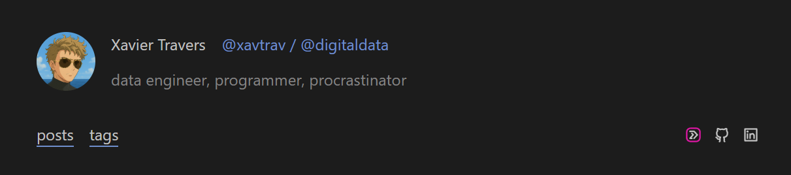
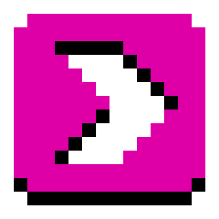
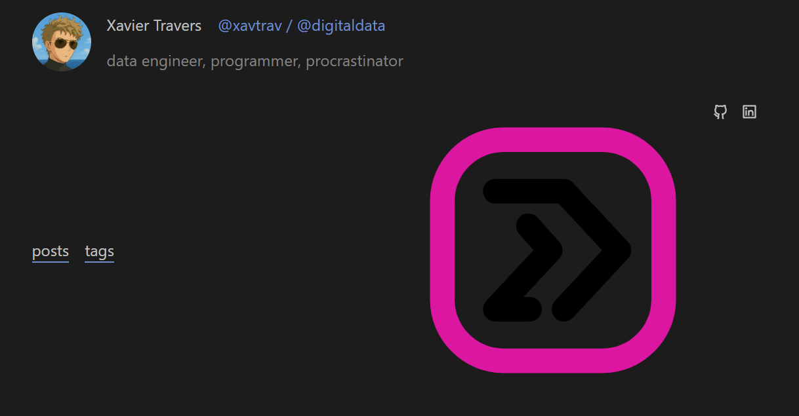

+++
author = "Xavier Travers"
title = "Exporting SVG icons for the web"
description = "While working on this site, I discovered that making SVGs in a simple web format is not simple. Let's solve that."
date=2025-10-13
[taxonomies]
categories=["micro-projects"]
tags=["web", "svg", "languages/python", "languages/javascript"]
+++

I chose the theme for this website with one goal in mind: simplicity.
It's a simple theme, it's simple to add content and the setup was simple. Great!
This website will likely change and evolve a lot over time. 
I chose this theme to circumvent the analysis paralysis that I run into while optimising for the future.

## So what?
One of my favorite aspects of [serene](https://github.com/isunjn/serene) is this profile header/banner on the homepage.



You may/may not have noticed one of icons on the right has a pink outline, and links to my old [p5.js](https://p5js.org/) portfolio website, [\<code\>digital](https://codedigital.me). I wanted to include a nod to my previous work that was stylish, but matched the style of icons used by the font. 
This was apparently, not a simple goal to achieve.

*I must admit I spent more time on this than I expected to.*

## Matching the icon style

The serene theme uses [Remix Icon](https://remixicon.com/) for the logos included.
These have a clean outlined look. My original \<code\>digital website logo would stand out like a sore thumb.


*I was and still am quite fond of a pixelated aesthetic.*

So to match the style of Remix Icon, I needed to:
1. Vectorize the icon with an outline style.
2. Save it to an SVG format similar to Remix Icon's.




I have been trying to remove subscriptions and open-source-ify my software library of late.
I may post about this.

Either way, as part of this goal, I wanted to try [Inkscape](https://inkscape.org/). 
I have [Affinity Designer 2](https://affinity.serif.com/en-us/designer/) and have never had an issue before, but I thought, "if I need to relearn the software anyway, why not learn the free/open-source software that won't require me to pay for a new update."

To cut a long story short, I got a bit overwhelmed with the user interface, and was concerned that this would eat my day just to add a simple icon to my website. *you may learn that I still managed to spend a lot of time to add that simple icon.* 
Either way, I decided to check if I still had some Affinity Designer 2 muscle memory (or even if the UI was just a bit more user-friendly)...
I cannot understate how much more intuitive the user interface felt. This could just be because I used the software before, but it just seemed to click with me.
So, as much as we love the free and open-source software out there, one must appreciate the value of having a business with funds to spare on proper user experience design/research.

\#notsponsored



Anyways, with the icon `.svg` in hand, I went to add it to the website.
Serene makes this easy: simple add the image to the `static/icon/` folder and refer to it by name in the links front-matter in your homepage index.

```toml,name=content/_index.md,linenos,hl_lines=2
links = [
    { name = "CodeDigital", icon = "codedigital", url = "https://codedigital.me" },
    { name = "GitHub", icon = "github", url = "https://github.com/digitaldata" },
    { name = "LinkedIn", icon = "linkedin", url = "https://www.linkedin.com/in/xavltrav/" },
]
```

All good, right? 

Here is what I saw:


- The size was way too large.
- The colour of the arrows was dark on a dark background.

## Fixing the icon

At first I thought that Affinity Designer 2 would have an export option specifically for the web, with scaling options and such. Alas, I am not so lucky. So I needed to dive into an example Remix Icon and compare it with what I had.

I noticed the following differences:
```xml,name=codedigital.svg,linenos,hl_lines=1-3 6 7
<?xml version="1.0" encoding="UTF-8" standalone="no"?>
<!DOCTYPE svg PUBLIC "-//W3C//DTD SVG 1.1//EN" "http://www.w3.org/Graphics/SVG/1.1/DTD/svg11.dtd">
<svg width="100%" height="100%" viewBox="0 0 24 24" version="1.1" xmlns="http://www.w3.org/2000/svg" xmlns:xlink="http://www.w3.org/1999/xlink" xml:space="preserve" xmlns:serif="http://www.serif.com/" style="fill-rule:evenodd;clip-rule:evenodd;stroke-linejoin:round;stroke-miterlimit:2;">
    <path d="M22,8l0,8c0,3.311 -2.689,6 -6,6l-8,0c-3.311,0 -6,-2.689 -6,-6l0,-8c0,-3.311 2.689,-6 6,-6l8,0c3.311,0 6,2.689 6,6Zm-2,0c0,-2.208 -1.792,-4 -4,-4l-8,0c-2.208,0 -4,1.792 -4,4l0,8c0,2.208 1.792,4 4,4l8,0c2.208,0 4,-1.792 4,-4l0,-8Z" style="fill:#de00a6;"/>
    <g>
        <path d="M13.624,17.485c-0.376,0.404 -1.009,0.427 -1.413,0.052c-0.404,-0.376 -0.427,-1.01 -0.051,-1.414l3.834,-4.123l-3.538,-3.804l-5.149,-0c-0.552,-0 -1,-0.448 -1,-1c-0,-0.552 0.448,-1 1,-1l5.585,-0c0.278,-0 0.543,0.115 0.732,0.319l4.468,4.804c0.357,0.384 0.357,0.978 0,1.362l-4.468,4.804Z"/>
        <path d="M10.098,15.804c0.552,0 1,0.448 1,1c0,0.552 -0.448,1 -1,1l-2.791,0c-0.398,0 -0.758,-0.236 -0.917,-0.6c-0.159,-0.365 -0.086,-0.789 0.185,-1.081l3.848,-4.138l-1.17,-1.312c-0.367,-0.412 -0.33,-1.045 0.082,-1.412c0.412,-0.367 1.045,-0.331 1.412,0.081l1.775,1.993c0.343,0.385 0.336,0.968 -0.015,1.346l-2.905,3.123l0.496,0Z"/>
    </g>
</svg>
```
- There was an `xml` declaration. Seemed redundant given it's a `.svg`.
- There was a `!DOCTYPE` tag. Also redundant.
- The `svg` had both its width and height set to `100%`. That may be a source of the sizing issue.
- The `path` tags in the arrow group (highlighted lines 6-7). This needs a `fill="currentColor"` attribute.

Now I could have addressed all of these issues manually and called it a day.
I probably *should* have. 
Instead, I decided that I may want to do this again, so I built a Python script.

### Python's `xml` library tries too hard...
... and sucks as a result.

I really struggled with extra "useful" information being added to the XML after being parsed by the `xml.etree.ElementTree`. 

For example, I had to manually remove the namespace before parsing the content of the `.svg` or I would get have every tag prefixed with a random `ns0` namespace. I could not find a argument, flag, or function, to disable this "feature". In the end it was just simpler to remove the `xmlns="http://www.w3.org/2000/svg"` before passing the file content to the parser, and to just add as a parameter after parsing.

There were plenty of these idiosyncracies I had to account for before I could get a simple parser script working. Another such situation I had to deal with was the formatting the XML object with `indent` (for display purposes) causing the resulting output to permanently keep indentations and new lines. Not very nice if I just wanted to keep the content minified. It was a minor issue, but it felt like there should have just been an interface with `pprint` or some `unparse` function with arguments to configure indentation.

Either way, the display issue is fixed after running [the script](https://github.com/DigitalData/svg-for-web/blob/master/convert_svg.py). I recommend against using the Python script as I have since created a small website to do this, with better configuration options.

### Javascript handles XML formats better
I rewrote the above functionality using with an HTML form and a simple client-side script in Javascript.
Javascript handles XML (and therefore SVG) file formats in a much more intuitive way.
This makes a lot of sense since one of the language's key usecases is manipulating the HTML (a tag-based XML-like markup language) via its Document Object Model API. This API has been extended to support SVG modification.

You can view and use the [SVG-for-web converter here](https://DigitalData.github.io/svg-for-web).
As you'll see when looking at the header on the live page, the recommended options (as well as applying a width and height of `18`) work perfectly to help me create my own SVG icons for web use.

## Why did I write this up?

I spent so much time on this just to get an icon working, so I felt that I should milk the experience a little.

Here is what I learned in the process:

**I need to start picking my battles better.**
I need to build a point of reflection into my work style in order to prevent going too deep into these rabbit holes where the payoff may be minimal. This will be a tough habbit to crack. While writing this post, I almost fell down the following rabbit holes:
- Can I convert the header/banner into a shortcode that I can paste in any of my markdown files? *Why would I ever need this again?*
- Where did Javascript originate? What was its original purpose? *I only needed this information for a certain expression I wanted to use (and didn't, in the end). No need to go deeper if the information did not match what I was looking for.*

**Just write the damn post. Even if I think it's wrong/useless work.**
I was debating whether to write this up today at work. My reasoning to be so dismissive was:
- I made the assumption that, while Affinity Designer 2 does not have an "Export for web icon" settings menu, Adobe Illustrator probably does. I have not checked this assumption. This article and resulting online tool would therefore not be as useful enough to merit a write-up.
- Perhaps I had over-engineered or re-engineered this solution. There is very likely a better tool out there to prepare SVGs for use as web icons.

However, I stormed ahead and wrote the post. I reaffirmed that I actually had good reasoning for the scripting decisions that I made, and feel a sense of pride as I reflect on this post.

**My writing skills need work, and that's okay.**
This post might read like a jumbled mess, and that is absolutely fine.
Not only is this blog meant to provide me with a dumping ground (deliberate word choice) of my thoughts, but I will definitely improve on my writing as I practice.
You don't get anywhere without that first step.

I hope you'll bear with me and I'll bear with me as I continue.

Cheers,

Xavier